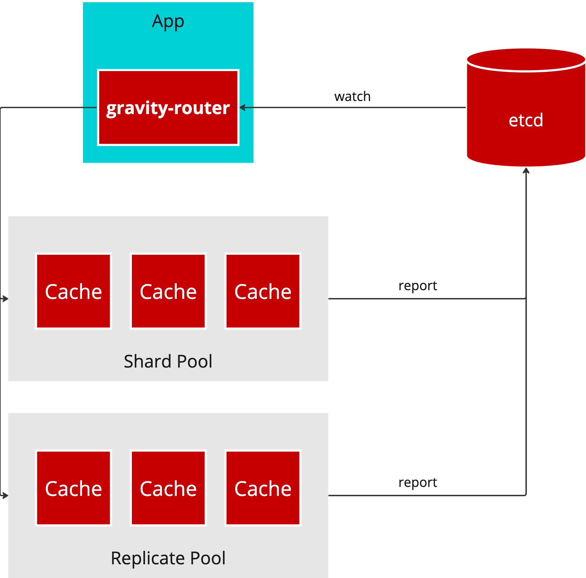
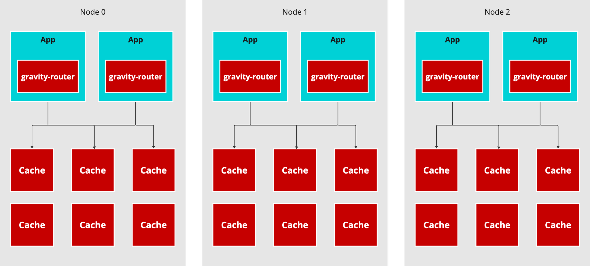
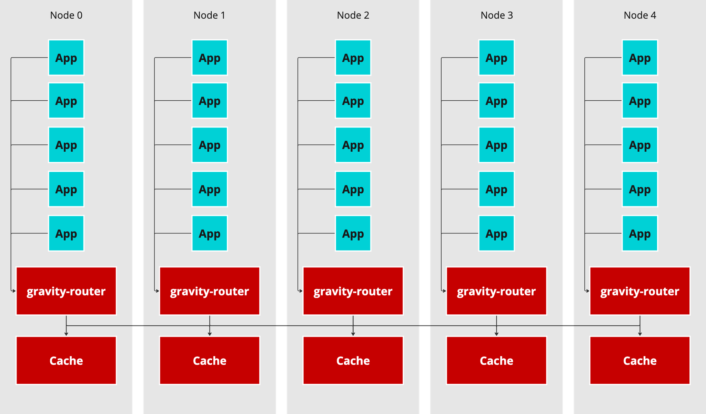
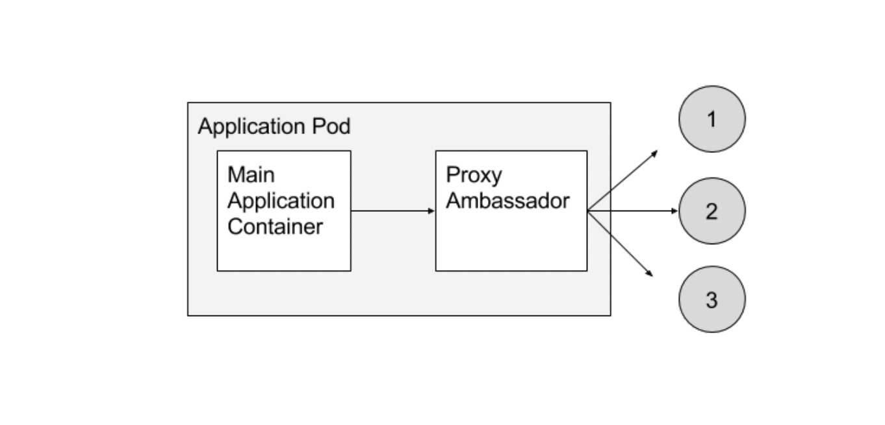
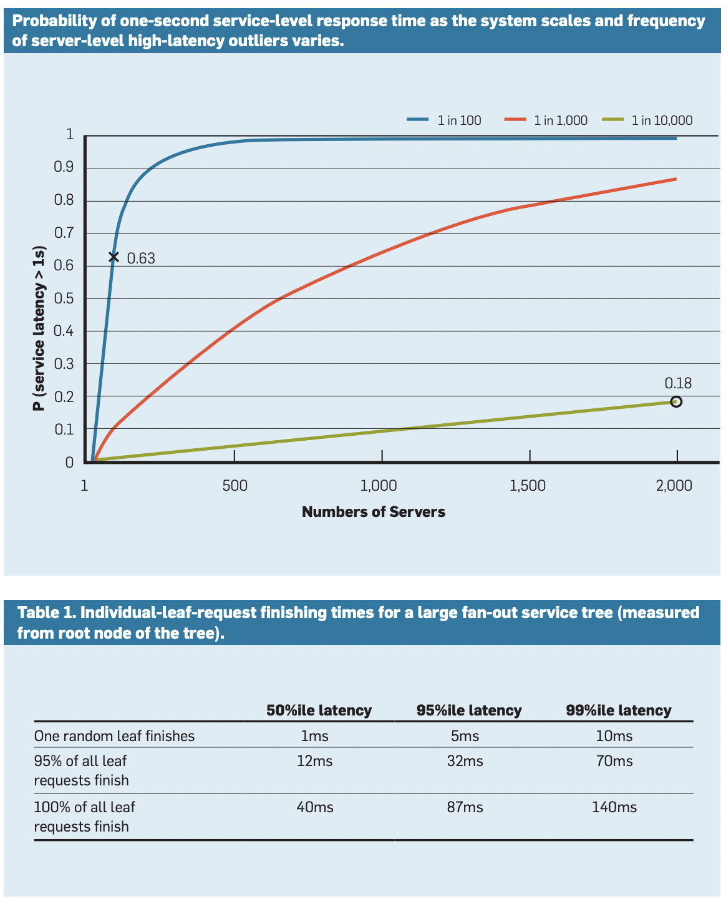
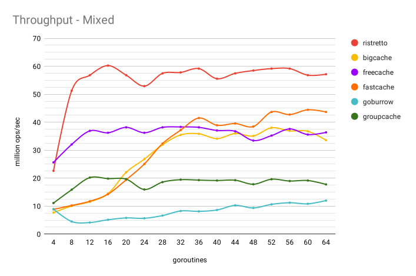
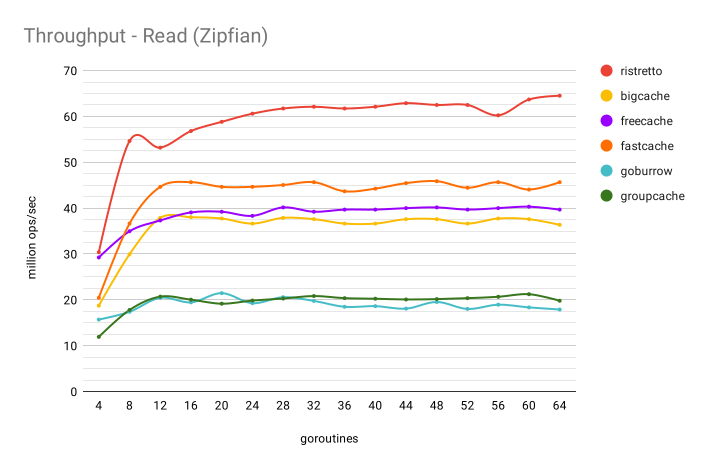
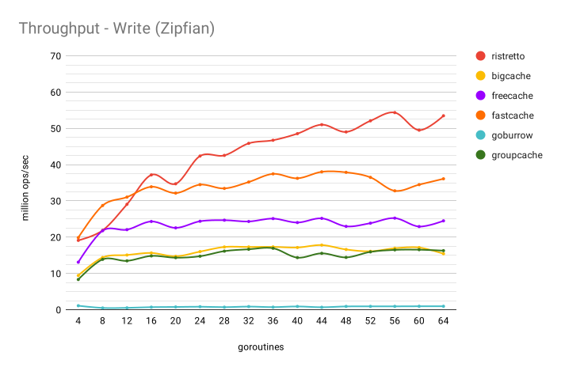
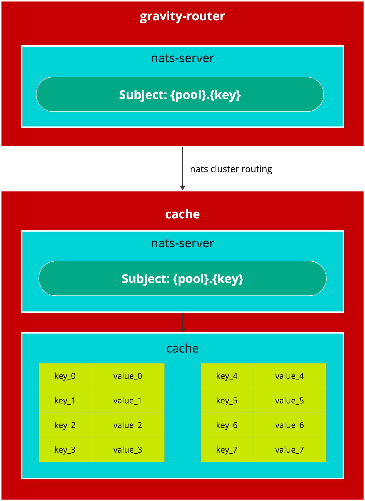

# gravity-router
gravity-router 主要實作 [Scaling Memcache at Facebook](https://www.usenix.org/system/files/conference/nsdi13/nsdi13-final170_update.pdf) 這篇 Distirbuted Cache 的概念，不過用 Go 語言實作，並且設計可以部署在 kubernetes 之上。

## Architecture & Design
### Logical Design

如上圖所示，所有的 request 都會經由 gravity-router 這個 Proxy 把請求發送到所屬的 cache instance 上面，cache 維運的單位是一組 Pool，可以依據需求選擇是要用 Shard Pool 還是 Replicate Pool，前者是維護相同的副本，後者是 Hash Partition。

至於要如何做到 Stateful 的管理，Pool 本身會把自己的 Kubernetes Resource 更新到 etcd (註記: 也可以用 Consul, JetStream, HA Key-Value Store)，當 Pool 的拓樸改變時，gravity router 可以動態計算出新的 routing logic。

使用方式就是 On-demand Look Aside 的用法，詳細請看論文內容。

### Kubernetes Deploy Architecture
#### Embedded Mode

Embedded Mode 這種部署模式實作了 Conatiner Pattern 中 Ambassador 的概念，在 Application Server 裡面植入一個 Ambassador Container，所有的請求都會經由此 Proxy 去呼叫相對應的 Cache Pool。

#### Daemonset Mode
Daemonset Mode 則是運用 Daemonset 的概念，在每一個 Node 上部署一個 Proxy 和 Cache Pod，針對 Locality 做出優化，所有位於該節點的 Application Pod 都可以當作 local service 呼叫。


### Client Interface
* all-async: 同步所有 Leaf 的操作，直到所有都回傳成功才算完成
* all-majority: 同樣是廣播到 Leaf，只要大多數回傳成功就算完成 
* failover: 實作 Google 的 Canary Requests

## Component
### Aggregate Layer
Aggregate Layer 主要由 NATS 所組成，扮演了 Leaf 的 Ambassador，詳細概念可以參考 Brendan Burns 的論文 [Design patterns for container-based distributed systems](https://static.googleusercontent.com/media/research.google.com/zh-TW//pubs/archive/45406.pdf)。

還有如果直接用 Application Server 和 N 個 Leaf Node 溝通，連線的數量是 O(n^2)，所以加入一層 Proxy 可以大幅減低內部網路擁塞。

#### Replicated Pool
Replicated Pool 其中一種模型，在 Replicated Pool 中的 Leaf Node 都擁有相同的副本，這樣有幾個好處。首先，可以做 Hedged requests，當有多個副本的時候，可以讓最低延遲的服務先回應，可以大幅減低 P99 的延遲，詳細參考 Jeff Dean 的 Google 伺服器管理論文 [The Tail at Scale](https://cseweb.ucsd.edu/classes/sp18/cse124-a/post/schedule/p74-dean.pdf)。


再來，就算是 Leaf 故障，也可以讓沒有故障的副本繼續服務達到 HA 的效果，最後如果有 Hot Spot 也可以經由分散 Requests 來應付高流量。

#### Sharded Pool
Sharded Pool 則是採用一致性雜湊將特定的 Key 分配到特定的 Shard 上，可以達到水平擴展的需求。

### Leaf Layer
Leaf Layer 單純是獨立的 In-memory 負責儲存 Cache 的資料，原始論文使用的是 memcached，不過這裡採用 Go 的實作 [ristretto](https://github.com/dgraph-io/ristretto)，擁有非常高的 Throughput，被許多 Go 的 Database 所使用，如下列表:
* Badger - Embeddable key-value DB in Go
* Dgraph - Horizontally scalable and distributed GraphQL database with a graph backend
* Vitess - Database clustering system for horizontal scaling of MySQL
* SpiceDB - Horizontally scalable permissions database
#### Benchmark




## Implementation Details

### gravity-router
gravity-router 用 NATS 作為 Interface，client 端操作就像操作一個 local 的 HashMap，將請求發到 NATS Subject 上，舉例來說: graivty-router 提供 ```Get(), Set(), Del()``` 等方法，Subject 本身是 Key，Message 的 Payload 是 Value，```nats.Msg{}``` 的 Header 夾帶 ```op``` 來表明這是什麼操作。一個 gravity-router 通常會連接多個 leaf cache instance，啟動的時候用 cluster route 把 leaf 的連線資訊傳入 gravity-router，並且用 watch 監聽變化。
### cache
cache 本身也是一個 ```nats-server```，用 ristretto 這個高效能的 cache 當作狀態機，所有的 client request 是完全複製 gravity-router 上的訊息，暴露的 API 就是 NATS Protocol，不過並不會 Ad-Hoc 的去呼叫這個 API，而是完全的由 gravity-router 當作應用層的統一入口。

## Getting Started
```go
func main() {

	client := NewClient()

	key := "key"
	value := []byte("value")

	err := client.Set(context.Background(), key, value, 3)
	if err != nil {
		log.Fatal(err)
	}
	log.Println("Set operation completed")

	client.Get(key)

	err = client.Del(context.Background(), key, 3)
	if err != nil {
		log.Fatal(err)
	}
	log.Println("Del operation completed")

}
```

## Reference
* [Scaling Memcache at Facebook](https://www.usenix.org/system/files/conference/nsdi13/nsdi13-final170_update.pdf)
* [Introducing mcrouter: A memcached protocol router for scaling memcached deployments](https://engineering.fb.com/2014/09/15/web/introducing-mcrouter-a-memcached-protocol-router-for-scaling-memcached-deployments/)
* [Turning Caches into Distributed Systems with mcrouter - Data@Scale](https://www.youtube.com/watch?v=e9lTgFO-ZXw&list=PLb0IAmt7-GS0HarXUJP6v4I5IPaCRkX3c&index=10)
* [Mcrouter](https://github.com/facebook/mcrouter/wiki)
* [Deploying Memcached on GKE](https://cloud.google.com/kubernetes-engine/docs/tutorials/deploying-memcached-on-kubernetes-engine)

## Auther
Tachun Wu <tachunwu.go@gmail.com>
